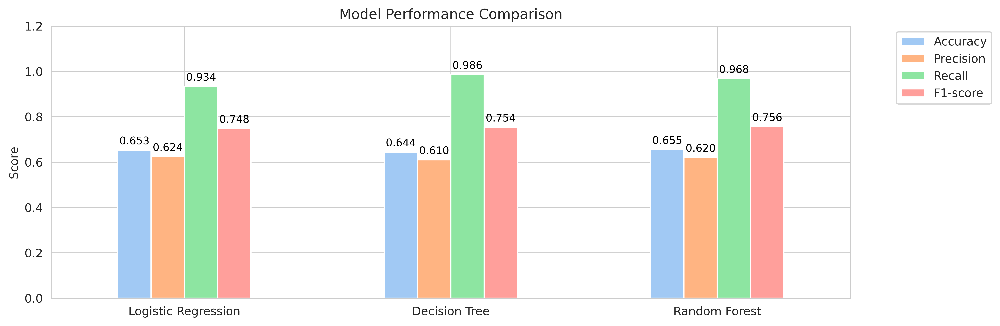

# Earthquake Damage Classification - Kavrepalanchok, Nepal 

[](https://www.python.org/)
[](https://scikit-learn.org/)
[](LICENSE)

> Predicting earthquake damage severity in Nepalese buildings using machine learning classification algorithms

## Project Overview

This project analyzes over 76,000 building records to predict earthquake damage severity (Grades 1-5) using building characteristics and multiple classification algorithms (Logistic Regression, Decision Tree, Random Forest). The best model (Random Forest) achieved **96.77% recall** for severe damage detection, making it highly effective for disaster response planning.

## Key Results

| Model | Accuracy | Precision | Recall | F1-Score |
|-------|----------|-----------|--------|----------|
| **Random Forest** | **0.6549** | **0.6202** | **0.9677** | **0.7559** |
| Decision Tree | 0.6441 | 0.6100 | 0.9856 | 0.7536 |
| Logistic Regression | 0.6530 | 0.6197 | 0.9342 | 0.7483 |

## Quick Start

1. Clone the repo
   ```bash
   git clone https://github.com/DominicNyabuto/Earthquake-Damage-Classification-Kavrepalanchok-Nepal.git
   cd Earthquake-Damage-Classification-Kavrepalanchok-Nepal

2. Install dependencies
   ```bash
   pip install -r requirements.txt
3. Run the notebook
   ```bash
   jupyter notebook notebooks/earthquake-nepal-classification.ipynb

## Dataset (kavrepalanchok_raw.csv) Features

The dataset includes **16 building characteristics**:
- **Structural**: Foundation type, roof type, superstructure material
- **Physical**: Age, height, floor count, area
- **Environmental**: Land surface condition, position
- **Post-earthquake**: Condition assessment

**Target Variable**: binary target severe_damage (0-1) was derived from damage_grade (Grade 1–5), where 0 = less severe (Grades 1–3) and 1 = severe (Grade 4-5).

## Methodology

### Data Preprocessing
- **Label Encoding** for categorical variables (efficient for moderate cardinality)
- **StandardScaler** for numerical features
- **Binary Classification** (severe_damage column with 0 and 1 as values for severe and less severe damage)

### Model Selection
1. **Logistic Regression**
2. **Decision Tree** 
3. **Random Forest** 

### Evaluation Strategy
- **Recall-focused metrics** (critical for disaster response)
- **5-fold Cross-validation**
- **Comprehensive classification reports**

## Model Performance Visualization

### 1. Classification Reports


### 2. Confusion Matrices


### 3. Model Performance Comparison



## Repository Structure
<pre>
   ├── data/
   ├── notebooks/ 
   ├── results/ 
   │   ├── figures/         
   │   └── models/   
   ├── .gitignore
   ├── LICENSE
   ├── README.md
   └── requirements.txt
</pre>


## Key Insights

1. **High Recall Priority**: In earthquake damage assessment, missing severely damaged buildings (false negatives) is more dangerous than false alarms
2. **Feature Importance**: Structural materials and building age are primary damage predictors
3. **Model Choice**: Random Forest - balances speed, accuracy, and categorical feature handling effectively

## Technology Stack

- **Python 3.8+**: Core programming language
- **Pandas & NumPy**: Data manipulation and analysis
- **Scikit-learn**: Machine learning algorithms and evaluation
- **Matplotlib & Seaborn**: Data visualization
- **Jupyter Notebook**: Interactive development

## Interactive Web App - Streamlit 

- [Link to Streamlit Web App](https://earthquake-damage-classification-nepal-random-forest.streamlit.app/)


